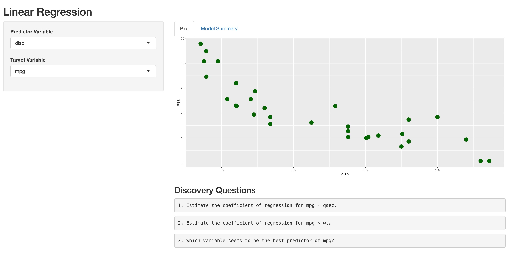
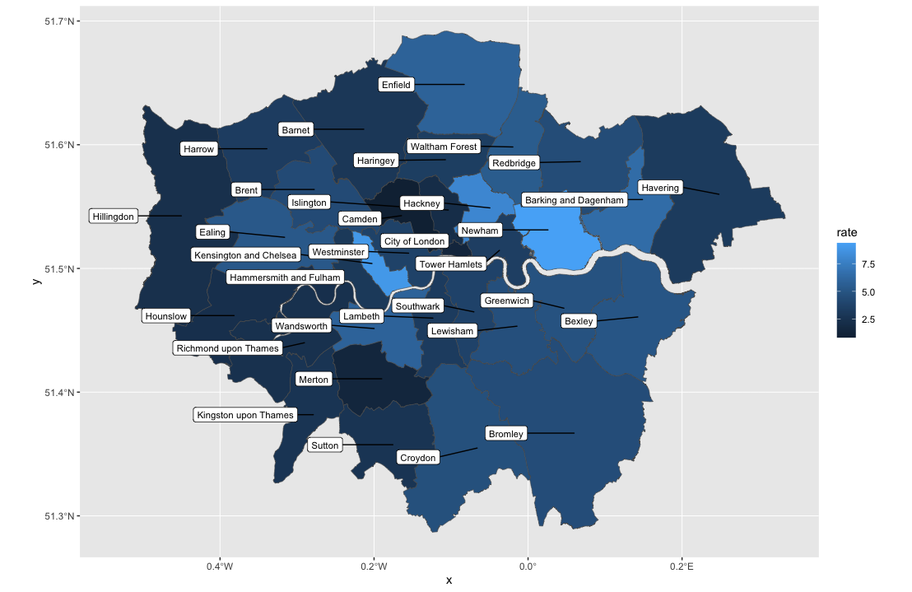

# Project 1 - Skill building and stakeholder communication

* Communicating the value of data analysis is key to building a data-driven decision making culture
* This project was focused on developing an application that allows users to experience linear regression and how it can help inform decisions
* The R Shiny Application was deployed on shinyapps.io 

## [Shiny Application for Linear Regression](https://comora.shinyapps.io/LinearReg/?_ga=2.255970251.1329687789.1682367085-379141333.1679908674)

# Project 2 - Data visualization

* London is a large city with 33 distinct boroughs
* Homelessness rates vary among the boroughs
* This project involved creating a heatmap in R to reflect varying rates of homelessness

